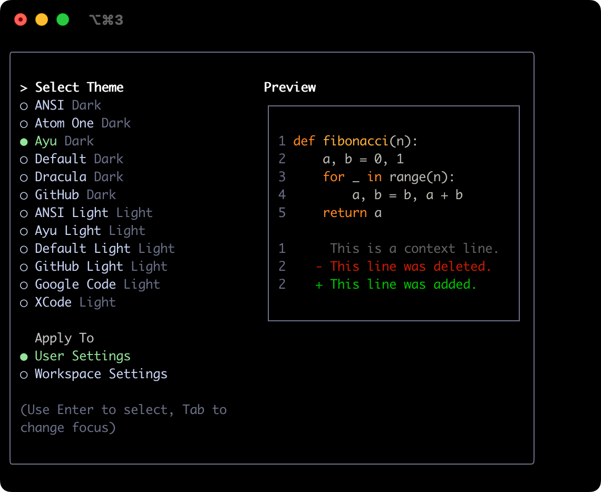
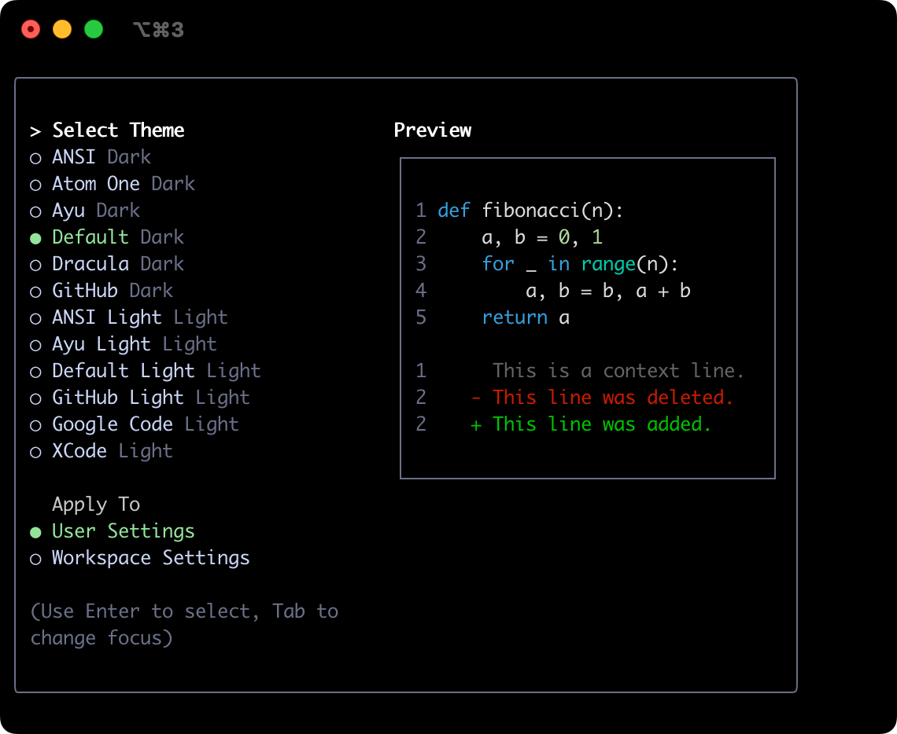
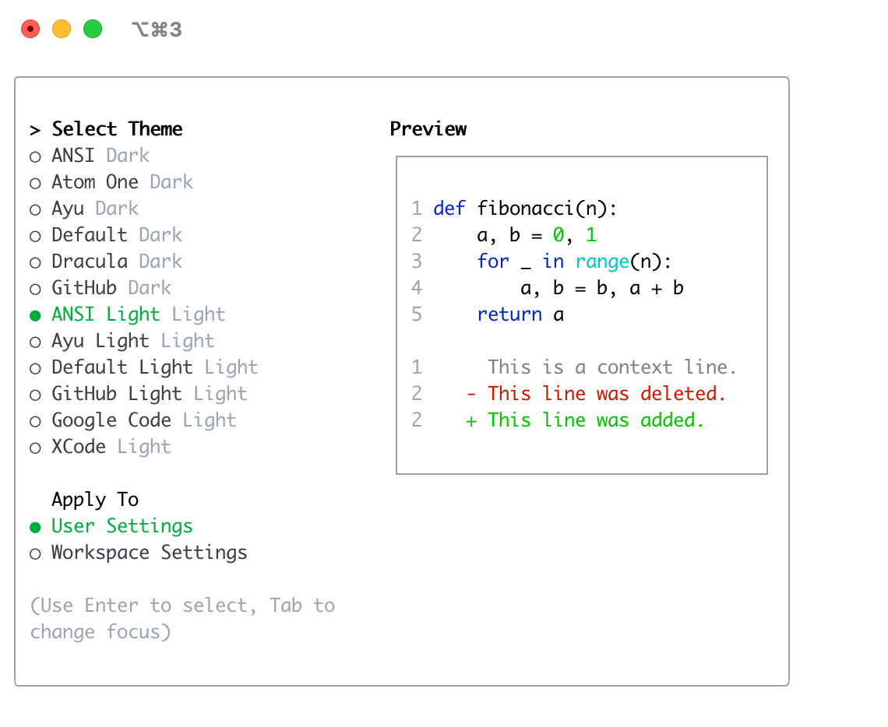
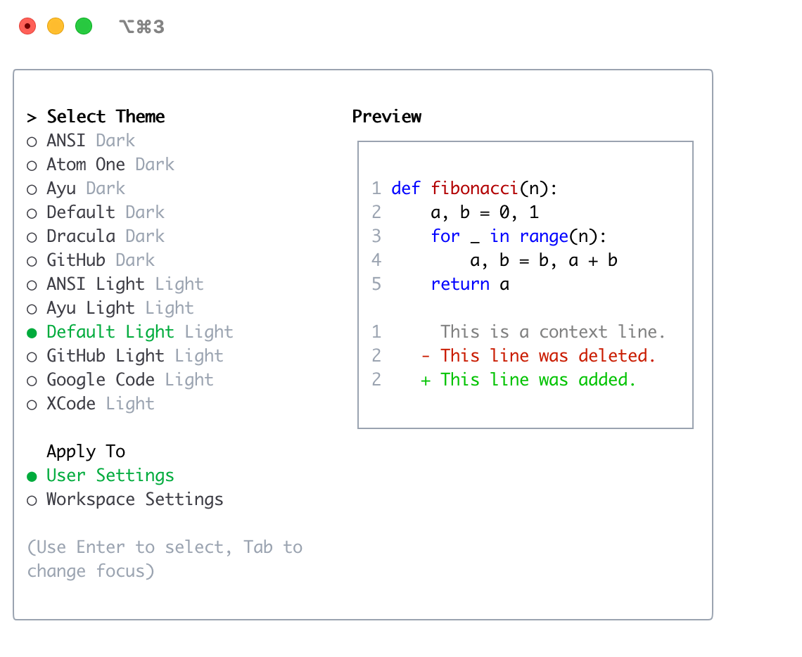
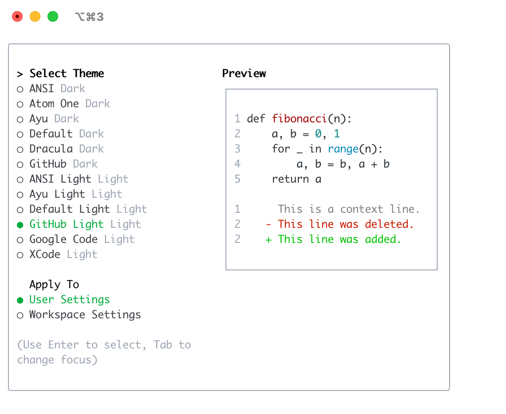
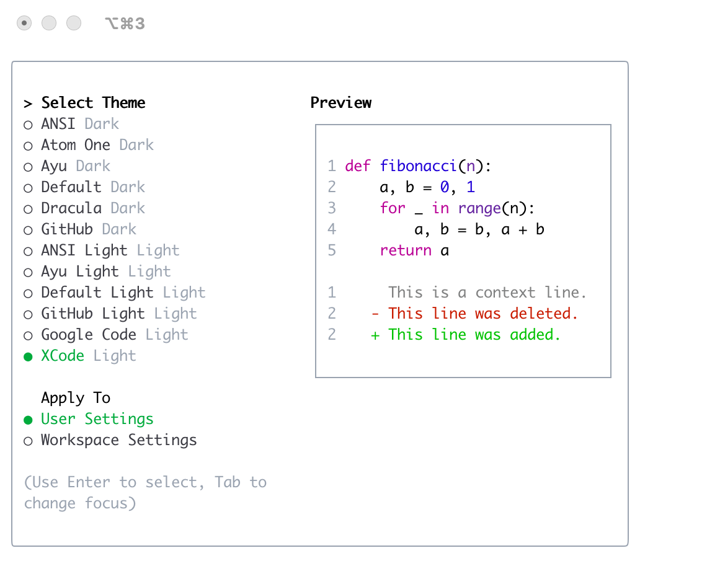

# 테마

Gemini CLI는 색상 구성표와 외관을 커스터마이징하기 위한 다양한 테마를 지원합니다. `/theme` 명령어 또는 `"theme":` 설정을 통해 선호도에 맞게 테마를 변경할 수 있습니다.

## 사용 가능한 테마

Gemini CLI는 사전 정의된 테마 선택을 제공하며, Gemini CLI 내에서 `/theme` 명령어를 사용하여 목록을 볼 수 있습니다:

- **다크 테마:**
  - `ANSI`
  - `Atom One`
  - `Ayu`
  - `Default`
  - `Dracula`
  - `GitHub`
- **라이트 테마:**
  - `ANSI Light`
  - `Ayu Light`
  - `Default Light`
  - `GitHub Light`
  - `Google Code`
  - `Xcode`

### 테마 변경

1. Gemini CLI에 `/theme`를 입력합니다.
2. 사용 가능한 테마 목록이 포함된 대화상자 또는 선택 프롬프트가 나타납니다.
3. 화살표 키를 사용하여 테마를 선택합니다. 일부 인터페이스는 선택할 때 라이브 미리보기나 하이라이트를 제공할 수 있습니다.
4. 선택을 확인하여 테마를 적용합니다.

### 테마 지속성

선택한 테마는 Gemini CLI의 [설정](/gemini-cli/cli/configuration)에 저장되어 세션 간에 선호도가 기억됩니다.

## 다크 테마

### ANSI

### Atom OneDark

### Ayu

### Default

### Dracula

### GitHub

## 라이트 테마

### ANSI Light

### Ayu Light

### Default Light

### GitHub Light

### Google Code

### Xcode

 