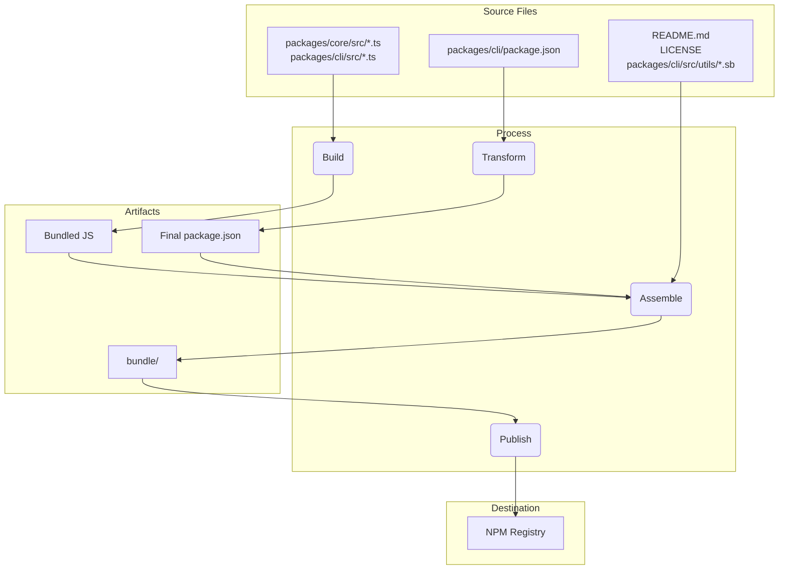

# 패키지 개요

이 모노레포에는 두 개의 주요 패키지, `@google/gemini-cli`와 `@google/gemini-cli-core`가 포함되어 있습니다.

## `@google/gemini-cli`

Gemini CLI의 메인 패키지입니다. 사용자 인터페이스, 명령 파싱, 기타 모든 사용자 대면 기능을 담당합니다.

이 패키지가 배포될 때는 모든 의존성을 포함한 단일 실행 파일로 번들링됩니다. 즉, 사용자가 `npm install -g @google/gemini-cli`로 설치하거나 `npx @google/gemini-cli`로 직접 실행하더라도 동일한, 자체 포함된 실행 파일을 사용하게 됩니다.

## `@google/gemini-cli-core`

Gemini API와 상호작용하는 핵심 로직을 담고 있습니다. API 요청, 인증 처리, 로컬 캐시 관리 등을 담당합니다.

이 패키지는 번들링되지 않고, 표준 Node.js 패키지로 배포됩니다. 별도의 프로젝트에서 독립적으로 사용할 수도 있습니다. `dist` 폴더의 모든 트랜스파일된 js 코드가 패키지에 포함됩니다.

# 릴리스 프로세스

이 프로젝트는 모든 패키지가 올바르게 버전 관리 및 배포되도록 구조화된 릴리스 프로세스를 따릅니다. 최대한 자동화되어 있습니다.

## 릴리스 방법

릴리스는 [release.yml](https://github.com/google-gemini/gemini-cli/actions/workflows/release.yml) GitHub Actions 워크플로우로 관리됩니다. 패치나 핫픽스 릴리스를 수동으로 하려면:

1. 저장소의 **Actions** 탭으로 이동
2. **Release** 워크플로우 선택
3. **Run workflow** 드롭다운 클릭
4. 입력값 작성:
   - **Version**: 릴리스할 정확한 버전 (예: `v0.2.1`)
   - **Ref**: 릴리스할 브랜치 또는 커밋 SHA (기본값은 `main`)
   - **Dry Run**: 실제 배포 없이 테스트하려면 `true`, 실제 릴리스는 `false`
5. **Run workflow** 클릭

## 나이틀리 릴리스

수동 릴리스 외에도, 매일 자정(UTC)에 자동으로 최신 버전을 배포하는 나이틀리 릴리스 프로세스가 있습니다.

### 프로세스

- `main` 브랜치의 최신 코드를 체크아웃
- 모든 의존성 설치
- `preflight` 체크 및 통합 테스트 전체 실행
- 성공 시 다음 나이틀리 버전(예: `v0.2.1-nightly.20230101`) 계산
- `nightly` dist-tag로 npm에 패키지 빌드 및 배포
- GitHub Release 생성

### 실패 처리

나이틀리 워크플로우가 실패하면 자동으로 `bug`와 `nightly-failure` 라벨이 붙은 이슈가 생성되고, 실패한 워크플로우 링크가 포함됩니다.

### 나이틀리 빌드 사용법

최신 나이틀리 빌드는 다음과 같이 설치할 수 있습니다:

```bash
npm install -g @google/gemini-cli@nightly
```

Google Cloud 빌드도 실행되어 샌드박스 도커 이미지를 릴리스에 맞춰 배포합니다. (곧 GitHub로 통합 예정)

### 릴리스 후

워크플로우가 완료되면 [GitHub Actions 탭](https://github.com/google-gemini/gemini-cli/actions/workflows/release.yml)에서 진행 상황을 확인할 수 있습니다. 완료 후:

1. [pull requests 페이지](https://github.com/google-gemini/gemini-cli/pulls)로 이동
2. `release/vX.Y.Z` 브랜치에서 `main`으로 새 PR 생성
3. PR을 리뷰하고 병합 (주로 package.json 버전 업데이트만 포함)

## 릴리스 검증

새 릴리스를 푸시한 후에는 패키지가 정상 동작하는지 스모크 테스트를 수행해야 합니다. 예시:

- `npx -y @google/gemini-cli@latest --version`으로 정상 푸시 확인
- `npx -y @google/gemini-cli@<release tag> --version`으로 태그 확인
- _로컬 파괴적_ `npm uninstall @google/gemini-cli && npm uninstall -g @google/gemini-cli && npm cache clean --force &&  npm install @google/gemini-cli@<version>`
- 주요 명령어와 도구를 실행해 정상 동작 확인 (향후 자동화 예정)

## 버전 변경 브랜치 병합 시점

패치/핫픽스 릴리스는 `release-<tag>` 브랜치를 반드시 `main`에 병합해야 합니다.
- 이유: main의 package.json 버전을 최신으로 유지해야 하며, 그렇지 않으면 혼란이 발생합니다.
- 방법: 릴리스 브랜치 생성 및 배포 후, release-v1.2.1을 main에 PR로 병합 ("chore: bump version to v1.2.1" 커밋만 포함)

프리릴리즈(RC, Beta, Dev)는 보통 main에 병합하지 않습니다.
- 이유: RC 등은 임시 버전이므로 main의 버전을 오염시키지 않기 위함입니다.
- 방법: 릴리스 브랜치 생성 및 배포 후, 브랜치 삭제

## 로컬 테스트 및 검증

실제 npm 배포 없이 릴리스 프로세스를 테스트하려면 GitHub UI에서 워크플로우를 수동 실행하세요.

1. [Actions 탭](https://github.com/google-gemini/gemini-cli/actions/workflows/release.yml) 이동
2. "Run workflow" 클릭
3. `dry_run` 옵션을 `true`로 둔 채 실행

이렇게 하면 실제 배포 없이 전체 릴리스 프로세스를 시뮬레이션할 수 있습니다.

패키징/배포 프로세스 변경 시에는 반드시 로컬에서 dry run으로 검증해야 합니다.

```bash
npm_package_version=9.9.9 SANDBOX_IMAGE_REGISTRY="registry" SANDBOX_IMAGE_NAME="thename" npm run publish:npm --dry-run
```

이 명령은 다음을 수행합니다:
- 모든 패키지 빌드
- prepublish 스크립트 실행
- npm에 배포될 tarball 생성
- 배포될 파일 및 package.json 변경사항 요약 출력

생성된 tarball을 직접 확인해 파일 및 버전이 올바른지 검증할 수 있습니다.

## 릴리스 심층 분석

릴리스의 목적은 packages/ 디렉토리의 소스 코드를 빌드해, 프로젝트 루트의 임시 `bundle` 디렉토리에 깔끔하게 패키징하는 것입니다. 이 디렉토리가 실제로 NPM에 배포됩니다.

### 주요 단계

1. **사전 점검 및 버전 관리**
   - preflight(테스트, 린트, 타입체크) 실행
   - package.json 버전 업데이트
2. **소스 코드 빌드**
   - TypeScript → JavaScript 컴파일
   - core, cli 각각 dist/로 이동
3. **최종 패키지 조립**
   - cli/package.json을 변환해 bundle/에 복사 (devDependencies 등 제거)
   - core 코드를 직접 번들에 포함
   - bin, main, files 필드 경로 수정
   - core/cli의 dist/index.js를 esbuild로 번들링해 bundle/gemini.js 생성
   - README.md, LICENSE, sandbox 프로필(.sb) 등 필수 파일 복사
4. **NPM 배포**
   - bundle/ 디렉토리에서 npm publish 실행 (불필요한 소스, 테스트, 개발 설정 제외)

#### 파일 흐름 요약



이 과정을 통해 최종 배포물은 개발 워크스페이스의 복사본이 아닌, 목적에 맞게 정제된 패키지로 완성됩니다.

## NPM 워크스페이스

이 프로젝트는 [NPM Workspaces](https://docs.npmjs.com/cli/v10/using-npm/workspaces)를 사용해 여러 패키지를 효율적으로 관리합니다.

### 동작 방식

루트 `package.json`에 다음과 같이 워크스페이스가 정의되어 있습니다:

```json
{
  "workspaces": ["packages/*"]
}
```

이 설정으로 `packages` 디렉토리 내 모든 폴더가 별도 패키지로 관리됩니다.

### 워크스페이스의 장점

- **의존성 관리 단순화**: 루트에서 `npm install`만 실행해도 모든 패키지의 의존성이 설치되고, 상호 연결됩니다.
- **자동 링크**: 워크스페이스 내 패키지 간 의존성은 symlink로 자동 연결되어, 한 패키지의 변경이 즉시 다른 패키지에 반영됩니다.
- **스크립트 실행 단순화**: 루트에서 `--workspace` 플래그로 각 패키지의 스크립트를 실행할 수 있습니다. 예시:

```bash
npm run build --workspace @google/gemini-cli
``` 